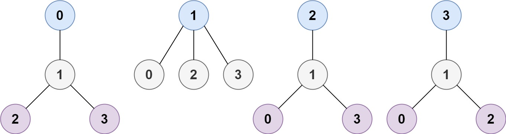

## 1.题目
树是一个无向图，其中任何两个顶点只通过一条路径连接。 换句话说，一个任何没有简单环路的连通图都是一棵树。  
给你一棵包含 n 个节点的树，标记为 0 到 n - 1 。给定数字 n 和一个有 n - 1 条无向边的 edges 列表（每一个边都是一对标签），其中 edges[i] = [ai, bi] 表示树中节点 ai 和 bi 之间存在一条无向边。  
可选择树中任何一个节点作为根。当选择节点 x 作为根节点时，设结果树的高度为 h 。在所有可能的树中，具有最小高度的树（即，min(h)）被称为 最小高度树 。  
请你找到所有的 最小高度树 并按 任意顺序 返回它们的根节点标签列表。  
树的 高度 是指根节点和叶子节点之间最长向下路径上边的数量。  

示例 1：  
```
输入：n = 4, edges = [[1,0],[1,2],[1,3]]
输出：[1]
解释：如图所示，当根是标签为 1 的节点时，树的高度是 1 ，这是唯一的最小高度树。
```  


示例 2：  
```
输入：n = 6, edges = [[3,0],[3,1],[3,2],[3,4],[5,4]]
输出：[3,4]
```  


示例 3：  
```
输入：n = 1, edges = []
输出：[0]  
```  

示例 4：  
```
输入：n = 2, edges = [[0,1]]
输出：[0,1]
```

提示：  
1 <= n <= 2 * 104  
edges.length == n - 1  
0 <= ai, bi < n  
ai != bi  
所有 (ai, bi) 互不相同  
给定的输入 保证 是一棵树，并且 不会有重复的边  

---

## 2.分析
对我而言，此题非常Hard，学到了很多东西。  
首先从大体思路上，此题不能对所有节点进行BFS，会超时，只能采用逐步剥去叶子节点的方法。为何此种方法可以得到问题的解，我想从直觉出发是不足以考虑清楚的，[这位大神](https://leetcode-cn.com/problems/minimum-height-trees/solution/bfszheng-que-xing-jian-dan-zheng-ming-by-yang-yan-/)的证明十分巧妙，值得学习。  
具体实现上，也有很多细节问题值得注意，感觉每次看完题解后，自己重新实现一遍还是很有必要的。  
题解参考的是[这位大神](https://leetcode-cn.com/problems/minimum-height-trees/solution/c-9623-jian-ji-yi-dong-tuo-bu-pai-xu-bian-shi-by-t/)